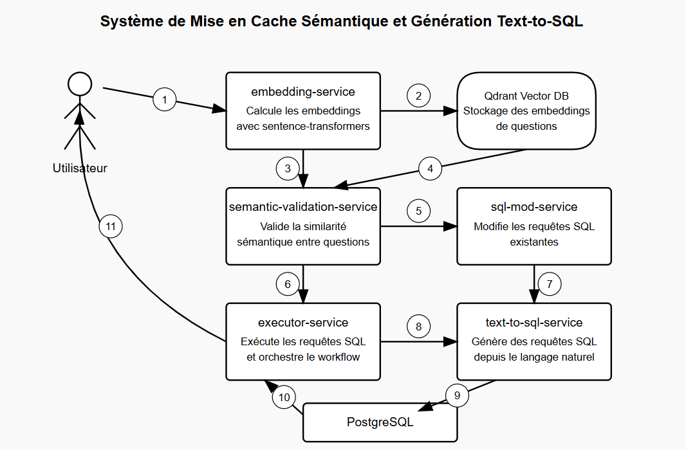

# Semantic Caching and Text-to-SQL Generation Project

This project implements a multi-agent architecture for semantic caching and Text-to-SQL generation, fully containerized with Docker Compose. The system optimizes SQL queries by reusing similar previously executed queries, with semantic validation and intelligent modification.

## Architecture



The project consists of 6 main services:

1. **vector-db**: Qdrant vector database to store embeddings of questions and SQL queries
2. **embedding-service**: Computes embeddings using sentence-transformers
3. **semantic-validation-service**: Validates semantic similarity between questions using Groq
4. **sql-mod-service**: Modifies existing SQL queries based on new questions using Groq
5. **text-to-sql-service**: Generates SQL queries from natural language questions using Groq
6. **executor-service**: Executes SQL queries on PostgreSQL and orchestrates the full workflow

## Prerequisites

- Docker and Docker Compose
- A Groq API key

## Installation

1. Clone this repository:
```bash
git clone <repository-url>
cd semantic-cache-sql-project
```

2. Create a `.env` file from the example:
```bash
cp .env.example .env
```

3. Add your Groq API key to the `.env` file:
```
GROQ_API_KEY=your_groq_api_key_here
```

4. Build and start the services with Docker Compose:
```bash
docker-compose build
docker-compose up -d
```

## Workflow

1. The user sends a natural language question to the executor service
2. The service computes the question's embedding and searches for similar ones in the vector DB
3. If a similar question is found (score > 0.85), semantic validation is done via Groq
4. If validated, the existing SQL query is modified for the new question
5. Otherwise, a new SQL query is generated from the question
6. The SQL query is executed on PostgreSQL and results are returned
7. If a new query was generated, it is stored in the vector DB for future use

## Usage

### Main Endpoint

To process a natural language question, send a POST request to the `/process` endpoint of the executor service:

```bash
curl -X POST http://localhost:8000/process \
  -H "Content-Type: application/json" \
  -d '{"text": "Which clients are located in California?"}'
```

### Testing the Features

This project includes several scripts to test the various features:


- `test_queries.sh`: shell script for quick tests using curl
- `test_workflow.py`: test the full system workflow
- `add_questions.py`: add example questions and SQL queries to the vector DB

Example usage of `test_workflow.py`:

```bash
python test_workflow.py
```

## Services and API Endpoints

### Embedding Service (Port 8001)

- **GET /health**: Health check
- **POST /embed**: Compute question embedding
- **POST /store**: Store question and SQL query in Qdrant
- **POST /search**: Search for similar questions in Qdrant

### Semantic Validation Service (Port 8002)

- **GET /health**
- **POST /validate**

### SQL Modification Service (Port 8003)

- **GET /health**
- **POST /modify**

### Text-to-SQL Generation Service (Port 8004)

- **GET /health**
- **POST /generate-sql**

### SQL Executor Service (Port 8000)

- **GET /health**
- **POST /execute**
- **GET /schema**
- **POST /process**

## Example Queries

- Which clients are located in California?
- Which products cost between $100 and $200?
- What are the 5 most ordered products?
- How many active clients do we have in each state?
- Who are the top 10 highest-spending clients?
- Which clients have never placed an order?
- What is the average order value per day of the week?
- Which products are frequently purchased together?
- Which clients placed their last order more than 3 months ago?

## Resetting the Vector Database

To reset the Qdrant vector database, use the `reset_qdrant.py` script:

```bash
python reset_qdrant.py
```

## File Structure

```
.
├── README.md
├── add_questions.py
├── docker-compose.yml
├── embedding-service/
│   ├── Dockerfile
│   ├── main.py
│   └── requirements.txt
├── executor-service/
│   ├── Dockerfile
│   ├── main.py
│   └── requirements.txt
├── postgres/
│   └── init/
│       └── init.sql
├── reset_qdrant.py
├── semantic-validation-service/
│   ├── Dockerfile
│   ├── main.py
│   └── requirements.txt
├── sql-mod-service/
│   ├── Dockerfile
│   ├── main.py
│   └── requirements.txt
├── test_queries.py
├── test_queries.sh
├── test_workflow.py
├── text-to-sql-service/
│   ├── Dockerfile
│   ├── main.py
│   └── requirements.txt
└── vector-db/
    ├── Dockerfile.qdrant
    ├── config/
    │   └── config.json
    ├── init.sh
    └── init_qdrant.py
```

## Best Practices

- Be specific in your questions
- Use terms consistent with your DB schema
- Start with simple questions to enrich the vector DB
- Review generated SQL to understand how it's interpreted

## Troubleshooting

Common issues:

1. **Services won't start**: Check logs using `docker-compose logs <service-name>`
2. **Groq API errors**: Ensure your key is set in `.env`
3. **Service connection issues**: Ensure all containers are up using `docker-compose ps`
4. **SQL query generation errors**: Rephrase your question or add more examples to the DB

### Service Health Check

```bash
curl http://localhost:8000/health
```

## Customization

### Change the embedding model

Update the `MODEL_NAME` variable in `embedding-service/main.py`.

### Change the Groq model

Update the `MODEL_NAME` in:
- `semantic-validation-service/main.py`
- `sql-mod-service/main.py`
- `text-to-sql-service/main.py`

### Change similarity threshold

Edit `SIMILARITY_THRESHOLD` in `executor-service/main.py`.

### Add more example questions

Update and run `add_questions.py`:

```bash
python add_questions.py
```


# semantic-cache-sql-project
